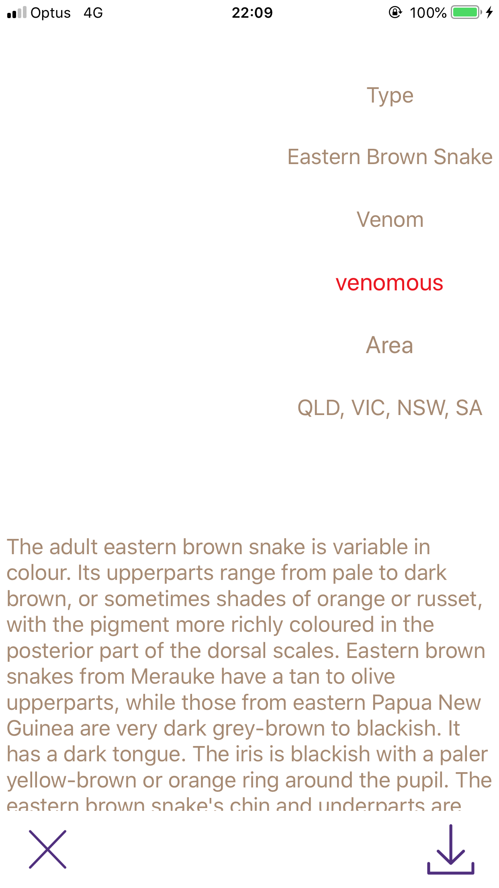
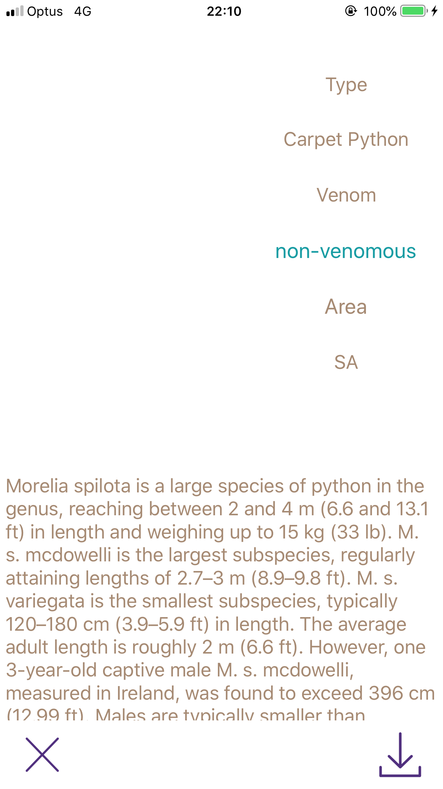
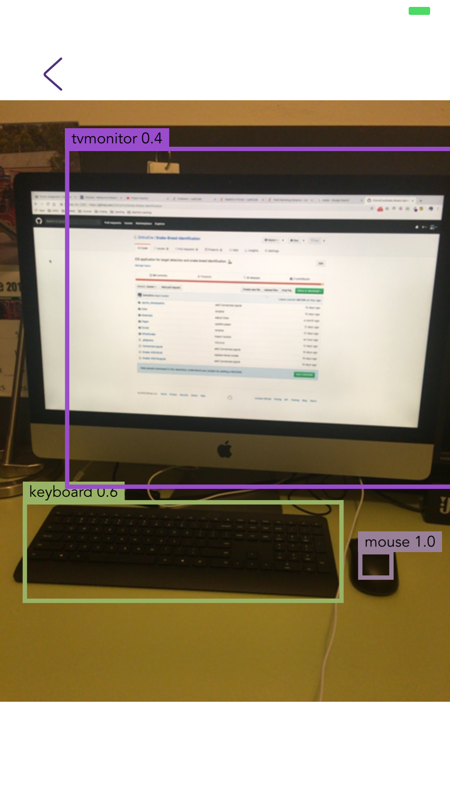

# Snake Breed Identification

This is an iOS application for target detection and snake breed identification.

The iOS application is in the folder *WhatSnake*.

## State

### Done

- iOS application (WhatSnake)
    - Main Page
    - Snake Information
    - Target Detection (YOLOv3)

- Transfer Learning (VGG16, MobileNet)

### ToDo

- iOS application
    - Model Conversion (Keras to Coreml)

- Advance Model
    - Faster-Rcnn
    - SSD
    - SeqSleepNet

## Demo

### Main Page

### Snake Information

### Detection

### Video

[Snake Breed Identification 20190502](https://www.youtube.com/watch?v=rGudAFElZk4&feature=youtu.be)