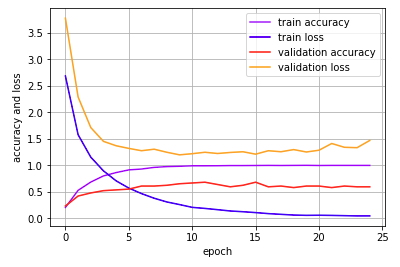

# Snake Breed Identification

## 1. Abstract

Deep learning is

## 2. Introduction

### Breed Identification

### Target Detection

### Framework

### iOS Application

## 3. Data Set

For the majority of computer vision problems, the quality and quantity of the dataset determine the performance of the neural network to a large extent. All the images will be transferred into the same-resolution pixels for the purpose to be recognized and distinguished by computers, then fed into the neural network, used to train the model in many epochs, and finally, after being convolved and pooled, become a confidence matrix, which is the output of the neural network.

For quality, it means that good datasets should include an object (sometimes may be multiple objects) to be classified, high resolution, exact label and bounding box information (only for object detection). For quantity, however, the image classification problem requires a huge amount of data which is extremely difficult to obtain. Thus collecting data becomes the most difficult part of all the jobs.

The number of breeds of snakes in Australia is roughly estimated at more than 30. Most of the breeds are covered in this project but not all, since some of which are rare and the images of these species are extremely hard to obtain. Every image is carefully censored and labelled before putting into the dataset.

### 3.1 Data Retrieving

In order to collect data, lots of data sources are tried but only a few are utilized given their quality of images. The most source used to collect data is Google Image. For each breed of snakes, batches of images can be retrieved by searching the breed name, and then the search results can be downloaded in bulk through Python scripts.

ImageNet is a large visual database designed for computer vision research. It contains more than 14 million images and more than 20,000 categories with a typical category. What is most impressing is that each image has bounding box information, which is wonderful for training model for object detection. Depressingly, The top search results under "snake" on ImageNet are Cobra, Night Snake, King Snake, etc., but for this project, we are focusing on snakes in Australia, none of which exists on ImageNet.

There are also some other datasets used in this project, including the Australian Reptile Online Database, Science Photo Library, The Reptile Database. However, the quality of these databases is quite low compared to Google Image, and the quantity is relatively small. Also, there are other problems existing on these databases, like wrongly-labelled.

### 3.2 Data Preprocessing

Although a huge amount of data are gathered, not every single image satisfy the requirement for being fed into neural networks. Also, for coloured images with three channels, we cannot put them into the neural network directly just like how grayscale images are dealt with. Therefore data preprocessing is needed to ensure the compliance of data from different sources, and also to enhance the performance of the model. 

(1) The first thing is to filter out low-resolution images. In this project, the scale of images fed into the neural network should be larger than 224*224 (width * height) pixels, otherwise, it will throw out the error that the image does not fit the input of the model. We can do some image stretching or interpolation to expand the scale of an image to the suitable size, but it just uses the pixel information already exist in the original image, which is useless for improving the accuracy of the model.

<image/low resolution>

(2) The second kind of images should be handled is that the images with much redundant information, especially for images with background occupying a large area and images with some unrelated objects in it. The proportion of the needed object (here the snake) should take most of the area and cannot be overwhelmed by information with no benefit to the results. To avoid this situation, clipping is a good approach to get rid of redundant information.

<image/redundant objects>

<image/without enough information>

(3) Some images downloaded from the Internet lack the label or are wrong-labelled. We must manually inspect each of the images and give those images the right label by examing and comparing them with the right breed of each.

(4) Before feeding the images into the neural network, all input images need to be reshaped to a certain scale (224*224 pixels in this project) to ensure the input layers can convolve the images correctly. The resize function in the OpenCV library is effective to handle this problem.

(5) Image normalization is an important step which ensures that each input pixel has a similar data distribution to facilitate the robustness of training. Image normalization transforms the raw images into a unified form, gets rid of innate structure inside the dataset by perturbing images, and makes it faster for training to converge. 
There are many ways to do image normalization, including Min-max Normalization and Zero-mean Normalization, etc. Min-max Normalization is done by subtracting the minimum value of all pixels and then dividing by the maximum value minus the minimum value of all pixels. Zero-mean Normalization is done by subtracting the mean of every pixel and then dividing by the standard deviation of every pixel where the first step aims to keep the sum of all values of the three channels equal to zero and the second step aims to make the variance of the values of the three channels equal to one. The process of normalization is essential for most deep learning tasks other than only computer vision problems.
In this project, image normalization is accomplished by using the scale function in the preprocessing module of the sklearn library.

### 3.3 Data Augmentation

When training computer vision models, collecting more data is an effective way to enhance the training but also a tedious and intricate process. In fact, for the majority of image recognition problems, we cannot get as much data as we expect. In order to obtain more data, data augmentation techniques is a very efficient method to improve the result. 

Data augmentation contains many methods, including flipping, rotating, cropping, scaling, warping, color shifting, adding noise, etc.

<example>

Also there are different ways to do data augmentation. One is offline augmentation, which means to perform all augmentations in advance before starting to build the neural network, and store all the images on hard disk drivers. It can access data very fast once after images are loaded into the memory, but it will increase, or multiple, the size of the dataset, which consumes memory to a large extent, so this method fits small datasets well. The other one is online augmentation, which means to perform the augmentation on a mini-batch dataset right before they are fed into the neural network. This method is more suitable for large datasets because the memory is limited for staging large scale images. For this project, the total number of images we have is <number> which is not big, so both methods are fine. For offline augmentation, we can use the imgaug library which has powerful stochastic interface to augment images, and, for online augmentation, we can use the ImageDataGenerator function in the preprocessing.image module in Keras.

### 3.4 Dataset Split

## 4. Deep Neural Network

### 4.1 Convolutional Neural Network

There are two main advantages of convolutional layers over fully connected layers (aka dense layers), and the advantages are parameter sharing and sparsity of connections. 

Parameter Sharing means a feature detector (such as a horizontal edge detector) that's useful in one part of the image is probably useful in all the other parts of the image. This is also true for higher level features, like detecting the curved body edge of snakes, and patterns on the body of snakes which can be used to distinguish categories of snakes. And being with a share the same parameters to compute all similar features, parameters are obviously reduced. Other than these, we don't need to learn separate feature detectors from scratch for our own neural network because the features of animals in images have some commonalities. Although some maybe look a little bit different by intuition, they are similar enough for computers after they are converted into pixels, and they can be detected by sharing feature detectors. That's why we can use transfer learning in computer vision tasks.

The second advantage is sparsity of connections. In the traditional neural network, since all neural units are connected, any unit of a layer is affected by all the units of the previous layer, and the effect of recognising an image is greatly reduced. In comparison, for convolutional layers, each region has its own unique features, and we do not want it to be affected by other regions, so we use convolution kernels (aka convolution matrix, or filter) to process a layer. In short, the rest of the pixel values other than the area we want to convolve do not have any effects on the output.

## 5. Training

### 5.1 Overfitting

Overfitting refers to that when a model fits the training data well but cannot predict the test data correctly, we may say that the model lacks the ability of generalization. When we observe that the accuracy on the training data has reached a very high ratio while the accuracy on the validation data still remains not high enough, or even a little bit low, and the value of loss function on the training data is much lower than that value on the validation data, we can say there is overfitting.

The most efficient way to prevent overfitting is to perform regularization on neural networks. Regularization constrains the learning process by adding a regularization term. In deep learning, there are two commonly-used regularization methods: Batch Normalization and Dropout.

Batch Normalization is proposed to solve two problems. One is that the input distribution of each layer changed as the number of layers deepens due to the activation functions. The other is that former layers need to adapt to the change of distribution. These two problems are called Internal Covariate Shift. We perform normalization on each layer separately, making the features of each layer have a mean of 0 and a variance of 1, which lets the value of each layer propagate in the effective range. we can also add a linear transformation operation so that the data can restore the ability of expression. Batch Normalization increases the robustness by normalizing the parameter. This constraint also improves the structural rationality of the system, and also accelerate convergence and prevent over-fitting.

Dropout means that when we are training the model, we can set a probability P for eliminating a node in the deep neural network. For each node, there is a probability of (1-P) for keeping it and a probability of P for dropping it. Then we perform forward-propagation and backpropagation-propagation on this much-diminished deep neural network. At each training step of a mini-batch dataset, the process of dropout creates a different deep neural network by randomly removing some units regarding the probability P. The process of dropout is similar to use ensemble learning on many different deep neural networks, each trained with a separate mini-batch dataset but share some context in the process of training. Since each classifier has been trained separately, it has learned different aspects of the dataset and their mistakes are different. Combining them helps to produce a more accurate classifier, which is less prone to overfitting. We can view dropout as a form of ensemble learning, and this is why it can prevent overfitting.

Data augmentation and early stopping are also good ways to prevent overfitting. Early Stopping is a trade-off between training epochs and validation accuracy. At the end of each epoch, compare current validation accuracy of this epoch with the best validation accuracy. If the accuracy on the validation set decreases or does not reach the best one for more than 10 consecutive epochs, we stop the training, and we think the accuracy is no longer improved.

If we have done all the methods above to prevent overfitting but the performance is still bad, we may consider simplifying our model. The model may be too complicated for our dataset to fit and we can try to reduce the complexity of the model in some ways, e.g. reduce the number of layers, remove some neurons, etc.

## iOS Application

## Conclusion

## Future Work
